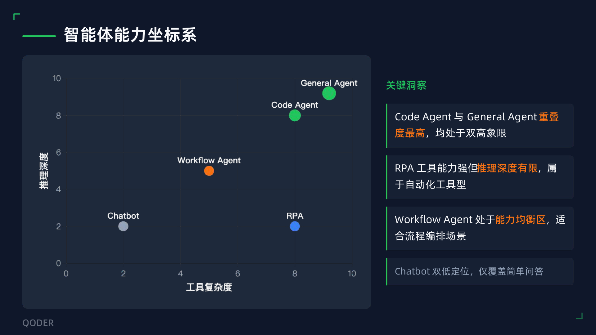
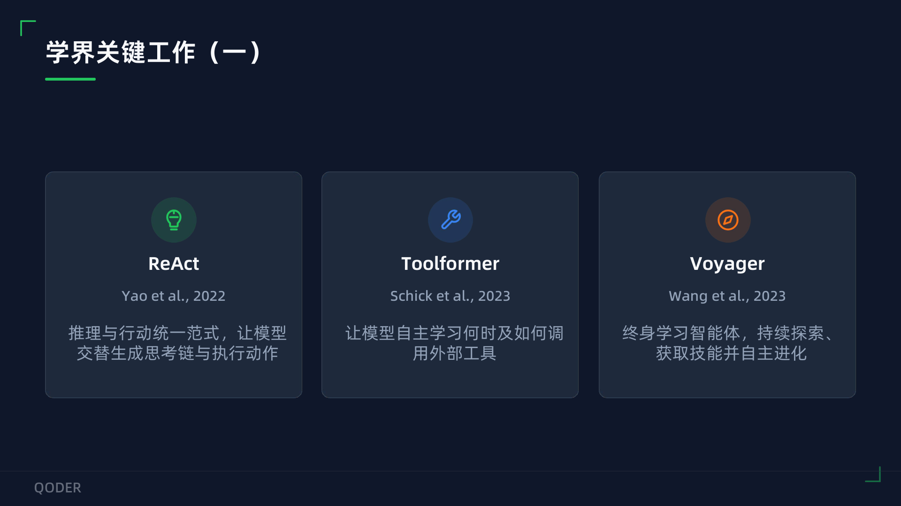

# lecture-notes-writer

> 基于“讲稿 PDF + 录音转文字”撰写详细、准确、客观、可追溯的讲座笔记的 Claude Code Skill。
>
> 双源对照 · 讲稿为准 · 客观呈现 · 可追溯 · 不臆测

---

## 一、它能做什么

`lecture-notes-writer` 用于把一场讲座、报告、技术分享或培训课程的**讲稿 PDF** 与**现场录音转文字**合成为一份高质量笔记。

核心能力：

- **完整覆盖**：按讲稿章节组织，融合讲者口述的临场案例、比喻、补充观点和问答信息。
- **数据准确**：数字、案例、论断必须能在讲稿或录音中找到依据；讲稿与录音冲突时，以讲稿为准。
- **客观呈现**：使用第三方客观视角，避免“某教授指出”“他强调”等主观人称表述。
- **原页嵌入**：按章节插入对应 PDF 原页截图，让笔记能回溯到原始讲稿页面。
- **来源规范**：若讲稿涉及论文、标准、产品、项目或数据来源，则为核心论断补充可追溯引用；没有来源材料时不强行补论文。
- **可追溯交付**：输出主笔记、PDF 页面截图、核心论文索引、关键数据速查表，并可选生成论文引用验证补充文件。

这个 skill 的定位不是“泛用摘要器”，而是**有证据锚点的讲座笔记撰写流程**：讲稿 PDF 是权威基准，录音转文字用于还原现场表达和补充上下文。

---

## 二、快速开始

准备好材料后，把它们放在同一工作目录，例如：

```text
工作目录/
├── 讲座讲稿.pdf
├── 讲座讲稿.pdf-<hash>/
│   ├── full.md
│   ├── MinerU_markdown_*.md
│   ├── images/
│   ├── *_content_list.json
│   └── *_origin.pdf
└── 录音转文字.txt
```

然后在 Claude Code 中说：

```text
请使用 lecture-notes-writer，根据 `讲座讲稿.pdf`、`讲座讲稿.pdf-<hash>/` 和 `录音转文字.txt` 撰写一份详细讲座笔记。
要求：以讲稿为准，融合录音中的现场补充，插入 PDF 原页截图，核对讲稿与录音冲突，输出到独立讲座文件夹。
```

预期输出：

```text
<讲座名>/
├── 笔记.md
├── pdf_pages/
│   ├── page_001.png
│   └── ...
└── 论文引用验证补充.md    # 可选，仅在启用深度论文验证时生成
```

---

## 三、适用与不适用场景

### 适用

- 学术讲座、技术报告、行业分享、培训课程。
- 同时有讲稿 PDF 或 MinerU 转换文件夹，以及现场录音转文字。
- 需要生成可追溯、带 PDF 原页截图的详细笔记。
- 需要核对讲稿与口述内容是否冲突。
- 需要把录音中的案例、问答、比喻、临场解释补回讲稿结构中。

### 不适用

- 只有 PDF，想做普通摘要。
- 只有录音，想做会议纪要。
- 只想提取 PDF 文本、表格或图片。
- 只想润色已有笔记。

本 skill 的核心价值是**双源对照**。如果只有单一来源，普通 PDF/文本处理流程通常更合适。

---

## 四、输入要求

### 输入完整度

| 模式 | 输入 | 是否推荐 | 说明 |
|------|------|----------|------|
| 完整模式 | 原始 PDF + MinerU 转换文件夹 + 录音转文字 | 推荐 | 支持完整七步工作流，包括结构化章节、页码映射和 PDF 原页截图 |
| 可用模式 | MinerU 转换文件夹 + 录音转文字 | 可用 | 若 MinerU 文件夹含 `*_origin.pdf`，可从中生成页面截图 |
| 待转换模式 | 原始 PDF + 录音转文字，但无 MinerU 文件夹 | 需先转换 | 建议先用 MinerU 生成 markdown、图片素材和 `content_list.json` |
| 不适用模式 | 只有 PDF 或只有录音 | 不建议 | 无法发挥双源对照价值 |

### 输入类型说明

| 输入 | 形式 | 用途 |
|------|------|------|
| 原始 PDF | 讲者提供的演讲 PDF，或 MinerU 文件夹中的 `*_origin.pdf` | 权威数据源；冲突时的真理基准 |
| MinerU 转换文件夹 | hash 命名文件夹，含 `full.md`、`MinerU_markdown_*.md`、`images/`、`*_content_list.json`、`*_origin.pdf` | 结构化文本、图片素材、页码映射 |
| 录音转文字 | URL、`.txt`、`.md` 或 Whisper/讯飞听见等导出文本 | 还原现场讲授内容、案例、问答、口误和临场补充 |

### MinerU 是什么

[MinerU](https://github.com/opendatalab/MinerU) 是 OpenDataLab 开源的 PDF 解析工具，可以把 PDF 转成结构化 markdown、图片素材和 JSON 元数据。本 skill 依赖 MinerU 的输出格式来做章节、页码和内容定位。

---

## 五、环境依赖

### 必装

| 依赖 | 版本 | 用途 | 安装命令 |
|------|------|------|----------|
| Python | 3.8+ | 运行脚本 | 系统自带或从 python.org 安装 |
| PyMuPDF | 最新 | PDF 转页面 PNG | `pip install PyMuPDF` |
| Pillow | 最新 | 评估图片像素尺寸 | `pip install Pillow` |

一键安装：

```bash
pip install PyMuPDF Pillow
```

PyMuPDF 安装可能较慢，首次使用 Step 4 图片处理时再装即可。

### 可选工具：grok-search MCP

本 skill 可以在没有 grok-search 的情况下工作；只有在需要访问录音转文字 URL、核查公开论文信息、补充公开事实时，才需要联网工具。

推荐使用 [GuDaStudio/GrokSearch](https://github.com/GuDaStudio/GrokSearch)。它是一个基于 FastMCP 的社区 MCP Server，为 Claude Code 提供 Grok 搜索、Tavily/Firecrawl 网页抓取和站点映射能力。

安装参考：

- GrokSearch 项目主页与安装说明：[https://github.com/GuDaStudio/GrokSearch](https://github.com/GuDaStudio/GrokSearch)
- Claude Code MCP 配置完成后，可用 `claude mcp list` 检查连接状态。

常用工具说明：

| 工具 | 用途 | 本 skill 中的使用场景 |
|------|------|----------------------|
| `mcp__grok-search__web_search` | 实时网络搜索，返回 Grok 综合回答 | 验证公开论文、作者、venue、arXiv 编号、公开 benchmark 数据 |
| `mcp__grok-search__get_sources` | 根据 `web_search` 的 `session_id` 获取来源列表 | 需要追溯搜索结果来源时使用 |
| `mcp__grok-search__web_fetch` | 抓取指定网页并转成 Markdown | 读取录音转文字 URL、公开论文页面或项目文档 |
| `mcp__grok-search__web_map` | 站点结构映射 | 通常不用；仅在需要遍历公开文档站点时使用 |

注意：不要把未公开讲稿、完整录音转文字或敏感内部资料提交给外部搜索工具。Step 5.5 论文验证只应用于公开论文和公开事实。

---

## 六、安装

Claude Code 中的 skill 本质上是一个包含 `SKILL.md` 的文件夹。安装时应复制整个 `lecture-notes-writer/` 文件夹，保留其中的 `SKILL.md`、`scripts/` 和 `references/`。

更多背景可参考 Anthropic 官方说明：[Using skills in Claude](https://support.claude.com/en/articles/12512180-using-skills-in-claude)。

### 用户级安装

适合希望在所有项目中使用该 skill 的情况：

```bash
cp -r lecture-notes-writer ~/.claude/skills/lecture-notes-writer
```

安装后应存在：

```text
~/.claude/skills/lecture-notes-writer/SKILL.md
```

### 项目级安装

适合只在当前项目中使用该 skill 的情况：

```bash
mkdir -p .claude/skills
cp -r lecture-notes-writer .claude/skills/lecture-notes-writer
```

安装后应存在：

```text
<project>/.claude/skills/lecture-notes-writer/SKILL.md
```

### 验证安装

重启 Claude Code 或开启新会话后，在对话中提出：

```text
我有讲稿 PDF 和录音转文字，请帮我整理成详细讲座笔记。
```

如果 skill 已正确安装，Claude 应在该类任务中自动加载 `lecture-notes-writer`。

注意：不要只复制 `README.md` 或只复制 `SKILL.md`。本 skill 依赖 `scripts/` 和 `references/` 中的辅助脚本与规则文件。

---

## 七、使用流程

### 自动触发示例

用户可以直接说：

```text
我有一场技术分享的讲稿 PDF、MinerU 转换文件夹，还有现场录音转文字。
请帮我把讲稿和实际讲授内容合成一份详细、客观、可追溯的讲座笔记。
```

Claude 应识别任务并加载本 skill。

### 七步工作流

```text
Step 1 资料读取      读 MinerU markdown + content_list.json + 录音转文字
Step 2 撰写初稿      按讲稿章节组织，融合录音案例和现场补充
Step 3 风格优化      段落整合、客观化表述、来源引用
Step 4 图片处理      PDF 转 PNG，按章节内容精准插入
Step 5 三维审查      自动化审查 + 准确性 + 图片一致性 + 完整性
Step 5.5 论文验证    可选；仅验证公开论文和公开事实
Step 6 冲突处理      讲稿 vs 录音，以讲稿为准
Step 7 输出附录      核心论文索引 + 关键数据速查表
```

### 输出结构

```text
工作目录/
└── <讲座名>/
    ├── 笔记.md
    ├── 论文引用验证补充.md
    └── pdf_pages/
        ├── page_001.png
        └── ...
```

---

## 八、脚本命令速查

```bash
# PDF 转页面截图
python scripts/pdf_to_pages.py "讲稿.pdf" "<讲座名>/pdf_pages"

# 提取讲稿章节页码
python scripts/extract_headings.py "<MinerU文件夹>/*_content_list.json"

# 审查笔记
python scripts/audit_notes.py "<讲座名>/笔记.md" \
  --content-list "<MinerU文件夹>/*_content_list.json" \
  --lecturer "讲者姓名"

# 验证图片与内容一致性
python scripts/verify_image_consistency.py "<讲座名>/笔记.md" "<MinerU文件夹>/*_content_list.json"

# 提取论文引用清单
python scripts/verify_citations.py "<讲座名>/笔记.md"
```

注意：不同脚本的参数以实际 `--help` 输出为准。README 中的命令用于说明典型调用方式。

---

## 九、笔记格式示例（图文对应节选）


### 示例 1：能力坐标系页



*↑ 讲稿原页（PDF 第 9 页）· 智能体能力坐标系*

对应笔记节选：

> 报告以“推理深度 × 工具能力”二维坐标系定位各类智能体：**Code Agent 与 General Agent 重叠度最高，均处于双高象限**；RPA 工具能力强但推理深度有限，属于自动化工具型；Workflow Agent 处于能力均衡区，适合流程编排场景；Chatbot 双低定位，仅覆盖简单问答。讲座现场进一步强调：“编译器不会撒谎”——代码世界的客观验证特性为 AI 提供了清晰反馈闭环，使代码智能体成为通用智能体进化的最佳训练场；并明确将代码智能体与战略配置锁定为“双高条件”，作为技术攻坚的核心突破口。

### 示例 2：学界关键工作与题外话



*↑ 讲稿原页（PDF 第 16 页）· 学界关键工作（一）：ReAct / Toolformer / Voyager*

对应笔记节选：

> 学界关键工作分为两组。第一组（基础范式）：**ReAct**（Yao et al., Princeton, ICLR 2023）将推理与行动统一为“Thought → Action → Observation”三段式交错生成范式，在 ALFWorld 和 WebShop 上分别取得 34% 和 10% 的绝对成功率提升；**Toolformer**（Schick et al., Meta AI, NeurIPS 2023）让模型通过自监督学习掌握何时调用工具、调用哪个工具、传什么参数，仅需少量演示即可使用计算器、搜索引擎、QA 等 5 类工具；**Voyager**（Wang et al., NVIDIA, 2023）作为首个基于 LLM 的终身学习具身智能体，在 Minecraft 中通过 GPT-4 黑盒 API（无微调）实现开放探索，比 AutoGPT/ReAct/Reflexion 多发现 **3.3×** 物品、**15.3×** 更快解锁关键技术树。
>
> 💡 **题外话（研究者观察）**：ReAct 论文 abstract 强调“推理+行动交错”范式，但论文第 3 节的 prompt 设计有一个容易被忽视的细节——Thought/Action/Observation **三段固定标签**而非自由格式。这一设计选择把“模型如何表达推理”标准化为可解析结构，使整个 Agent 循环可被外部工具直接介入与观测。论文 5.2 节实验显示，ReAct 在 HotpotQA 和 FEVER 上比纯 chain-of-thought 更可解释、更少幻觉——作者明确归因为“外部观察”对内部推理的纠偏作用。

---

## 十、目录结构

```text
lecture-notes-writer/
├── README.md                          # 本文件
├── SKILL.md                           # 核心 skill 定义（带 frontmatter）
├── .gitignore                         # 防止误提交真实讲稿、转写、生成笔记和页面截图
├── scripts/                           # 可执行脚本
│   ├── pdf_to_pages.py                # PDF → PNG 页面截图
│   ├── filter_mineru_images.py        # 评估 MinerU 散图质量
│   ├── extract_headings.py            # 提取章节-页码映射
│   ├── verify_image_consistency.py    # 验证图片-内容一致性
│   ├── audit_notes.py                 # 自动化审查（主观人称/路径/数字）
│   └── verify_citations.py            # 提取论文引用清单（Step 5.5）
├── references/                        # 详细参考文档
│   ├── writing-guide.md               # 撰写要点、段落组织、引用格式
│   ├── style-guide.md                 # 客观化表述替换表
│   ├── conflict-resolution.md         # 冲突处理决策树与典型案例
│   ├── audit-checklist.md             # 详细审查清单
│   └── citation-verification.md       # 论文验证 + 题外话规则
└── examples/                          # README 展示用示例图
```

---

## 十一、核心设计原则

| 原则 | 含义 |
|------|------|
| 双源对照 | 所有数据、案例、论断必须能从讲稿或录音中找到出处；冲突时以讲稿为准 |
| 客观呈现 | 禁用“某教授指出”等主观人称，用“报告指出”“讲座中提及”等中性表达 |
| 可追溯 | 每张图标注 PDF 页码；重要论断尽量有来源说明；关键数据可回溯到原始资料 |
| 不臆测 | 资料里没有的不编造；不确定事实先验证或请用户确认 |

---

## 十二、常见问题

### Q1：录音转文字是 AI 智能纪要，不是逐字稿，怎么办？

A：仍然可用，但需要降级处理。智能纪要能反映主要观点和临场讨论，但细节密度低于逐字稿。撰写时应以讲稿为骨架，只把纪要中明确出现的补充内容融合进去，不补写纪要没有支持的细节。

### Q2：讲稿和录音数据冲突怎么办？

A：以讲稿为准。讲稿通常是讲者事先准备的权威表达，现场口述可能有口误。详见 `references/conflict-resolution.md`。

### Q3：MinerU 散图质量差怎么办？

A：直接弃用散图，改用 PDF 完整页面截图。MinerU 提取的散图可能包含图标、装饰元素或低分辨率碎片。运行 `scripts/pdf_to_pages.py` 把 PDF 各页转 PNG，再按章节内容精准插入。

### Q4：要做多个讲座笔记，资源会冲突吗？

A：不会。每个讲座独立一个文件夹，例如 `<讲座名>/笔记.md` 和 `<讲座名>/pdf_pages/`，避免多个讲座的 `page_001.png` 互相覆盖。

### Q5：题外话会不会脱离讲者本意？

A：题外话默认关闭，且只能基于公开论文自身内容。允许引用 abstract、intro、method、ablation、experiments、conclusion 中的事实，不允许加入笔记作者对后续工作的猜测或资料没有支持的推论。详见 `references/citation-verification.md`。

### Q6：必须安装 PyMuPDF 和 Pillow 吗？

A：只用 Step 1-3 可以暂时不装。一旦进入 Step 4 图片处理，就必须安装。脚本会在缺包时提示安装命令。

---

## 十三、版本与许可

- 版本：1.0.0
- 依赖：Python 3.8+、PyMuPDF、Pillow
- 可选 MCP 工具：grok-search，用于公开事实核查与论文验证
- 许可：暂未声明；公开发布前请补充 LICENSE 文件或明确仅供个人使用

### Changelog

#### v1.0.0

- 建立七步工作流。
- 新增 PDF 原页截图插入流程。
- 新增三维审查与自动化审查脚本。
- 新增论文引用验证与题外话规则。

