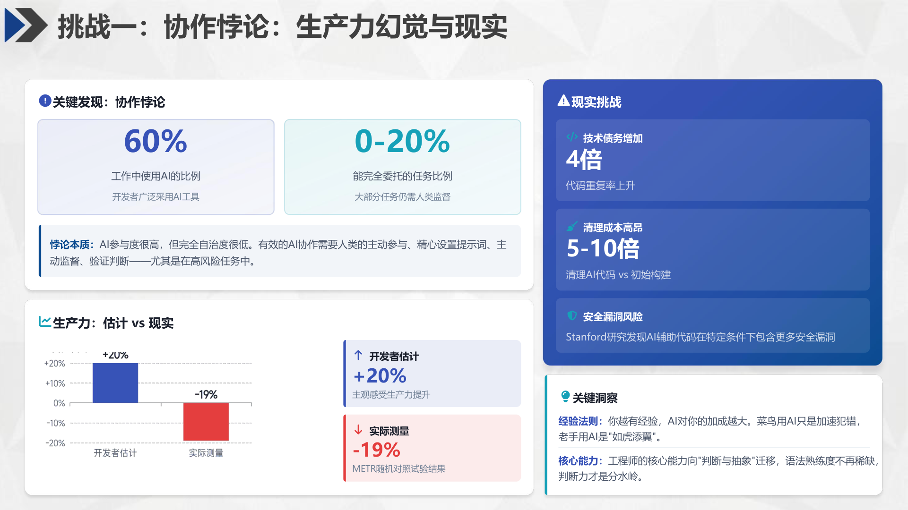
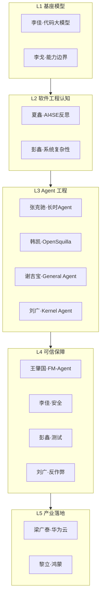
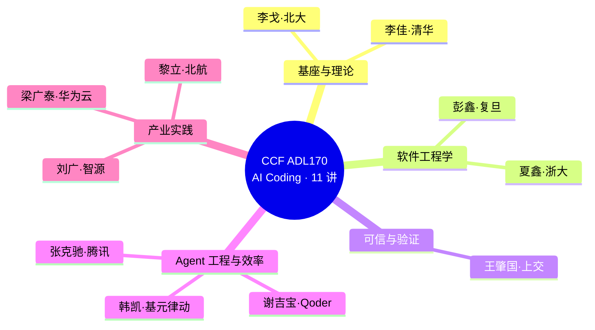

# lecture-tools

> 把"听讲座 / 开会 / 读论文"沉淀成结构化知识的 Claude Code 插件——从**一场讲座的详细笔记**到**多场讲座的整合综述**。
>
> 双源对照 · 讲稿为准 · 客观呈现 · 可追溯 · 不臆测

> ⚠️ **版权声明**：本仓库示例中引用的讲义材料（讲稿、页面截图、数据、代码片段）版权归原作者所有，本仓库仅作个人学习整理与技术示范，不作商业用途。

`lecture-tools` 是一个包含两个互补 skill 的 Claude Code plugin：

| skill | 解决的问题 | 一句话 |
|---|---|---|
| **lecture-notes-writer** | 一场讲座的讲稿 PDF + 录音 → 详细笔记 | "这场讲了什么" |
| **lecture-synthesis-writer** | N 场讲座资料 → 体现"联系、关系、发展"的综述 | "这些场之间有何关联" |

二者可串联：先用 `lecture-notes-writer` 产出各场单篇笔记，再用 `lecture-synthesis-writer` 整合成总体研究笔记。

---

## 一、为什么需要它

讲座、技术分享、学术报告是最前沿的知识来源，但沉淀成可复用的笔记很难：

- **讲稿与现场不一致**：讲稿是准备好的权威版本，现场口述有口误、临场案例、问答延伸——单看任一边都会丢信息。
- **多场之间缺乏联系**：听完一个系列的十场报告，每场单独记，却看不出它们之间的呼应、对立、演进。
- **难以追溯**：笔记里的数字、论断、论文，事后想核对却找不到出处。

`lecture-tools` 用一套**有证据锚点的流程**解决这两层问题：单篇笔记做到双源对照、原页可追溯；整合综述做到跨场联系、知识图谱化。

---

## 二、skill 1：lecture-notes-writer（单场笔记）

### 定位

把**一场**讲座的讲稿 PDF（含 MinerU 转换）与现场录音转文字，合成一份详细、准确、客观、可追溯的笔记。讲稿 PDF 是**权威基准**，录音用于还原现场表达与补充上下文。

### 核心能力

- **完整覆盖**：按讲稿章节组织，融合讲者口述的临场案例、比喻、问答。
- **数据准确**：数字/案例/论断必须在讲稿或录音中找到依据；冲突时**以讲稿为准**。
- **客观呈现**：第三方客观视角，禁用"某教授指出"等主观人称。
- **原页嵌入**：按章节插入对应 PDF 原页截图，笔记能回溯到原始讲稿页。
- **可追溯引用**：讲稿涉及的论文/标准/产品为核心论断补充可追溯引用；没有来源时不强行补。

### 七步工作流

```
Step 1  资料读取      读 MinerU markdown + content_list.json + 录音转文字
Step 2  撰写初稿      按讲稿章节组织，逐条对照录音，完整记录（含案例/比喻/问答）
Step 3  风格优化      段落整合、客观化表述、来源引用
Step 4  图片处理      PDF 转 PNG，按章节精准插入
Step 5  三维审查      自动化审查 + 准确性 + 图片一致性 + 录音覆盖率
Step 5.5 论文验证     可选；仅验证公开论文与公开事实
Step 6  冲突处理      讲稿 vs 录音，以讲稿为准
Step 7  输出附录      核心论文索引 + 关键数据速查表
```

### 触发方式

提供讲稿 PDF + 录音转文字，说"整理成详细讲座笔记"即可自动触发；或显式 `/lecture-notes-writer`。

---

## 三、skill 2：lecture-synthesis-writer（多场整合）

### 定位

把 **N 份**讲座/报告/论文资料（讲稿、已有单篇笔记、录音）整合成一份体现**联系、关系、发展**的研究综述笔记。它不拼接单篇，而是把资料当节点，回答跨场问题。

### 核心能力

- **双轴框架**：静态轴（把 N 源映射到分层结构，回答"关系"）+ 动态轴（提炼跨源主线，回答"联系与发展"）。
- **跨源主线**：找出多场讲座共同浮现的概念、对立的观点、互补的方法。
- **争议辨析**：把不同讲者的对立/印证判断并列，标明真实分歧 vs 被调和的分歧。
- **问答聚类**：按主题跨场重组 Q&A，而非逐场罗列。
- **解读边界**：显式区分"事实"（源里有据）vs"解读"（你的框架/归并），诚实标注软肋。

### 七阶段流程

```
阶段 1  资料勘察      列资料矩阵，标缺口
阶段 2  背景核实      检索活动/讲者/主题的官方信息
阶段 3  并行精读      每源派 agent，统一 9 节模板，双源对照
阶段 4  框架设计      双轴（分层 + 主线），每源都能放进框架
阶段 5  整合撰写      逐源卡片 + 跨源主线 + 争议 + 问答 + 图文互证
阶段 6  多轮核查      内容核查 + 讲稿原文复核 + 连带一致性 + 图表专项
阶段 7  解读边界      区分事实 vs 解读，列出软肋
```

### 触发方式

提供 ≥2 份资料，说"整合/总体笔记/梳理联系/知识图谱"即可自动触发；或显式 `/lecture-synthesis-writer`。

---

## 四、两个 skill 如何串联

典型场景：参加了一个系列讲习班（如某学术活动的 10 场报告）。

```
原始资料/（10 份讲稿 PDF + MinerU + 录音）
        │
        │  对每场用 lecture-notes-writer
        ▼
笔记/<讲座1>/笔记.md  …  笔记/<讲座10>/笔记.md  （10 份单篇笔记）
        │
        │  用 lecture-synthesis-writer 整合
        ▼
笔记/<主题>-总体笔记.md  （1 份跨场综述：分层版图 + 跨源主线 + 争议 + 问答）
```

---

## 五、实际产出示例（真实片段）

> 以下片段取自真实笔记（CCF ADL170《AI Coding》11 场讲座），展示单篇笔记与整合综述的实际质量。完整笔记见仓库外的 `笔记/` 目录。

### 单篇示例 1：双源数据冲突 + 客观呈现（夏鑫）



*↑ 讲稿原页（PDF 第 30 页）· 协作悖论 + 生产力悖论*

对应笔记节选：

> 行业调研揭示"协作悖论"：**约 60% 开发者用 AI，但仅 0–20% 任务能完全委托**。METR 随机对照试验进一步揭示生产力悖论：开发者**主观感受 +20%**，**实际测量却 −19%**；技术债增加 4 倍以上，AI 代码清理成本是初始构建的 5–10 倍。由此提炼"经验法则"——越有经验 AI 加成越大，菜鸟加速犯错、老手如虎添翼；核心能力向"判断与抽象"迁移，**语法熟练度不再稀缺，判断力才是分水岭**。

**格式要点**：冲突数据并列呈现（主观 vs 客观，不回避矛盾）、客观人称、加粗关键论断、从数据提炼洞察而非堆数字。

### 单篇示例 2：论文引用 + 研究者"题外话"（谢吉宝）


*↑ 讲稿原页（PDF 第 16 页）· 学界关键工作（ReAct / Toolformer / Voyager）*

笔记不只记录讲者讲什么，还为引用的论文补规范引用 + 研究者深度观察：

> 学界关键工作第一组（基础范式）：**ReAct**（Yao et al., Princeton, ICLR 2023）将推理与行动统一为"Thought → Action → Observation"三段式，在 ALFWorld/WebShop 取得 34%/10% 绝对提升；**Toolformer**（Schick et al., Meta AI, NeurIPS 2023）让模型自监督学会调用工具；**Voyager**（Wang et al., NVIDIA, 2023）作为首个 LLM 终身学习具身智能体，比 AutoGPT 多发现 **3.3×** 物品。
>
> **参考论文**：
> - Yao et al. *ReAct*. ICLR 2023. arXiv:2210.03629
> - Schick et al. *Toolformer*. NeurIPS 2023. arXiv:2302.04761
> - Wang et al. *Voyager*. 2023. arXiv:2305.16291
>
> 💡 **题外话（研究者观察）**：ReAct 论文 abstract 强调"推理+行动交错"，但第 3 节 prompt 有个易被忽视的细节——Thought/Action/Observation **三段固定标签**而非自由格式，把推理标准化为可解析结构，使 Agent 循环可被外部工具介入与观测。
>
> 💡 **题外话（研究者观察）**：Toolformer 第 3 节训练流程：模型先**采样潜在工具调用**，执行后**只保留能降低后续 token 损失的调用**作训练数据——学到的不是"何时用工具"的规则，而是"用工具后预测更准"的统计信号。

**格式要点**：论文带 venue + arXiv（可追溯）、题外话基于论文自身内容（abstract/方法/ablation，不臆测）、讲者观点与研究者观察区分呈现。

### 整合示例 · 知识图谱（静态轴）

11 场讲座映射到五层技术栈——一眼看清关系（刘广、彭鑫各横跨两层）：



### 整合示例 · 讲者主题全景（mindmap）

11 位讲者按研究取向归类（取自总体笔记"全景"部分）：



### 整合示例 · 跨源脉络（动态轴）

> 以下为总体笔记"主线六·上下文、记忆与 Token 经济"原文：

**故事**：当 Agent 跑长任务，"上下文/记忆/成本"就成了生死问题。7 场讲座从模型侧、系统侧、评测侧共同攻关。

| 维度 | 讲座 | 贡献 |
|---|---|---|
| **模型侧·长上下文** | 李佳 | CoLA 128K 上下文对齐；dLLM 长上下文衰减更小 |
| **系统侧·上下文工程** | 谢吉宝 | Context Window ≠ Context Engineering；四件套；U 形盲区 |
| **系统侧·记忆** | 韩凯 | 四层持久记忆 + Session Flush + Memory Dream（离线巩固） |
| **系统侧·Token 路由** | 韩凯 | SquillaRouter 185 维特征，省 60–80% 成本 |
| **长任务·目标漂移** | 张克驰 | Dynamic Workflow 对抗 goal drift / agentic laziness |
| **边界·上下文天花板** | 夏鑫 | 多语言协同（Python 50%/TS<10%）；"更大窗口 ≠ 更深理解" |
| **成本·执行资源化** | 黎立 | RunLess——执行是有成本资源，省 56–62% token |
| **成本·Compute 才是真成本** | 刘广 | Token 不是成本、Compute 才是（多 Agent 一夜烧 500 万）；KernelGen 把多芯适配 O(M×N×K) 降到 O(M+N+K) |

**共同的警句**：
- 谢吉宝：**"差检索比无 RAG 更糟。"**
- 夏鑫：**"更大的窗口不等于更深的理解。"**
- 韩凯：**"优化核心不是模型池 M，而是 Harness 操作 s 与模型路由 g。"**
- 黎立（引洪定坤）：**"AI 写码速度是人 10 倍，但人均吞吐率仅 +60%。"**

### 整合示例 · 争议辨析

> 以下为总体笔记"争议四·生产力悖论"原文——全场数据最分裂的争议：

- 📈 **梁广泰引 DORA 2025**：90% 开发者用 AI、80% 认为生产力显著提升、59% 认为代码质量更好。
- 📉 **夏鑫引 METR 随机对照试验**：主观感受 **+20%**，实际测量 **−19%**；技术债 +4 倍；清理成本是构建的 5–10 倍。
- 📊 **黎立引洪定坤**：TRAE 团队 94%+ 代码 AI 生成，AI 写码速度是人 10 倍，但**人均需求吞吐率仅 +60%**。
- 💰 **梁广泰引 ICLR 2026**：未来三年 Agent token 消耗 ×70。

**调和**：主观感受与客观测量的差距，源于**"写代码快"≠"交付需求快"**（正确 ≠ 可上线）。

---

## 六、安装与启用

本 plugin 已发布为 GitHub marketplace（`maliaosaide/lecture-notes-writer`）。在 Claude Code 中依次执行两条命令完成安装：

```
/plugin marketplace add maliaosaide/lecture-notes-writer
/plugin install lecture-tools@lecture-tools
```

安装完成后（若提示则执行 `/reload-plugins`），两个 skill 自动可被触发。验证：

```
我有讲稿 PDF 和录音，请整理成详细讲座笔记。        → 触发 lecture-notes-writer
把这 10 场讲座整合成一份总体研究笔记。              → 触发 lecture-synthesis-writer
```

> 注：必须执行上述 `/plugin` 命令完成 marketplace 注册与插件安装；仅在 `settings.json` 里写 `enabledPlugins` 声明不会自动拉取与注册，skill 不会生效。

---

## 七、环境依赖

| 依赖 | 用途 | 安装 |
|---|---|---|
| Python 3.8+ | 运行脚本 | 系统自带 |
| PyMuPDF | PDF 转页面 PNG | `pip install PyMuPDF` |
| Pillow | 评估图片像素 | `pip install Pillow` |

首次需要把 PDF 转图片时再装（PyMuPDF 安装较慢）。`lecture-synthesis-writer` 通常直接用已有的 `pdf_pages/`，不强依赖脚本。

**可选**：[grok-search](https://github.com/GuDaStudio/GrokSearch) MCP，用于公开论文/事实核查与录音 URL 抓取。只应用于公开材料，不要把未公开讲稿/录音提交给外部搜索。

---

## 八、核心设计原则

| 原则 | 含义 |
|---|---|
| **双源对照** | 所有数据/案例/论断必须能从讲稿或录音找到出处；冲突以讲稿为准 |
| **客观呈现** | 禁用主观人称，用"报告指出""讲座中提及"等中性表达 |
| **可追溯** | 每张图标注 PDF 页码；重要论断有来源；关键数据可回溯 |
| **不臆测** | 资料里没有的不编造；不确定先验证或请用户确认 |
| **完整记录** | 个人笔记非发布物——讲者讲过的案例/比喻/问答都完整记录，不主观筛选 |
| **防凑字数** | 密度是诊断信号而非指标——不为增加行数重复截图内容或同一洞察 |
| **图文互证** | 每张图都有图注 + 正文论述对应，不只装饰 |
| **归并克制**（整合） | 跨源"归同"谨慎，过度归并要加注差异 |
| **解读边界**（整合） | 显式区分事实 vs 你的框架/归并，诚实标注软肋 |

---

## 九、目录结构

```
lecture-tools/                        ← 仓库根（plugin 项目）
├── .claude-plugin/plugin.json         ← plugin 清单
├── .claude-plugin/marketplace.json    ← marketplace 清单（/plugin marketplace add 读取）
├── README.md  LICENSE  .gitignore
├── scripts/                           ← 【共享】7 个脚本
├── references/                        ← 【共享】style / conflict / citation
└── skills/
    ├── lecture-notes-writer/          ← 单场笔记 skill
    │   ├── SKILL.md
    │   ├── examples/                  ← README 示例图
    │   └── references/                ← 独有：writing-guide、audit-checklist
    └── lecture-synthesis-writer/      ← 多场整合 skill
        ├── SKILL.md
        └── references/                ← 独有：source-extraction-template、audit-checklist
```

> 目录名与 plugin 名均为 `lecture-tools`（见 `plugin.json`）。

---

## 十、常见问题

**Q1：只有录音转文字链接（如讯飞听见），没有本地文件，能用吗？**
可以。提供链接，skill 抓取页面内容；讯飞听见等 SPA 页面会尝试获取"原文"逐字稿（非 AI 纪要）。

**Q2：讲稿和录音同一数据不一样，写哪个？**
以讲稿为准（讲稿是讲者准备好的权威版，现场可能有口误）。差异大时在"整理说明"标注。

**Q3：同时做多场讲座，会互相干扰吗？**
不会。每场在 `笔记/<讲座名>/` 独立子目录，互不覆盖。

**Q4：笔记会有图片吗？**
会。PDF 每页渲染为 PNG，按章节精准插入。

**Q5：问答环节会记录吗？**
会，完整记录——问题原文 + 讲者完整回答（含金句、临场案例），不概括。

**Q6：现场提到的企业内部案例会写进笔记吗？**
会。个人笔记非公开发布物，公开会议讲过的内容都完整记录。

**Q7：整合综述和单篇笔记什么关系？**
单篇复述一场；整合综述回答多场之间的联系。可串联：先单篇再整合。

**Q8：整合综述里的"分层版图""跨源主线"是讲者的共识吗？**
**不是**——那是整理者构建的组织框架（有用的工具，但非客观事实）。综述会显式标注"解读边界"。

**Q9：必须装 PyMuPDF/Pillow 才能用吗？**
读讲稿/录音不需要。生成 PDF 页面截图（单篇 Step 4）时需要。首次使用提示安装。

**Q10：讲座引用很多论文，笔记会有论文信息吗？**
默认标注作者/会议/核心贡献。需深入验证（arXiv 编号、ablation、"题外话"观察）可说"深度整理"，启用可选论文验证流程。

---

## 十一、版本与许可

- 版本：2.0.0（plugin 化，合并 lecture-notes-writer + lecture-synthesis-writer）
- 依赖：Python 3.8+、PyMuPDF、Pillow
- 可选 MCP：grok-search（公开事实核查与论文验证）
- 许可：MIT License（适用于本仓库的代码与文档）
- **讲义材料**：讲座讲稿、截图、数据、代码片段版权归原作者所有；本仓库仅作学习整理示范，不作商业用途（见顶部版权声明）

### Changelog

#### v2.0.0
- **plugin 化**：lecture-notes-writer 与新的 lecture-synthesis-writer 合并为 `lecture-tools` plugin。
- **共享资源提取**：7 个脚本 + 3 个参考文档（style/conflict/citation）提到 plugin 根，两 skill 用 `${CLAUDE_PLUGIN_ROOT}` 引用。
- **新增 lecture-synthesis-writer**：七阶段流程（资料勘察→背景核实→并行精读→双轴框架→整合撰写→多轮核查→解读边界），解决多场讲座整合问题。
- **路径可移植**：所有跨目录引用改用 `${CLAUDE_PLUGIN_ROOT}`，不再硬编码。

#### v1.2.0（lecture-notes-writer 单 skill 末期）
- 目录结构重组为三层（原始资料/笔记/temp）。
- 录音抓取分级回退；新增逐字稿完整性审查。
- 图片插入策略升级（每子论点配图，一论点跨多页全插）。

#### v1.0.0
- 建立七步工作流、PDF 原页截图、三维审查、论文验证。
