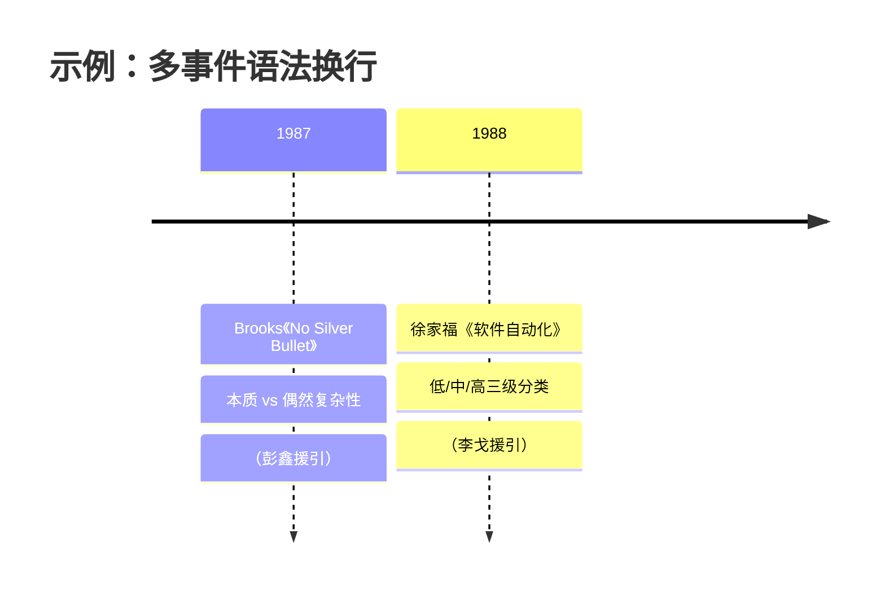

# 单源精读模板与整合框架（reference）

> 阶段 3（并行精读）与阶段 4/5（框架/撰写）使用。每份资料源填一份精读模板；整合时套用骨架与卡片范式。

---

## 一、单源精读 9 节模板（每源一份）

> 给精读 agent 的统一指令模板。要求：详尽但精炼，保留所有关键数字、专有名词、论文/系统名；忠于原文，不确定明确标注，不编造。

```markdown
## 1. 基本信息
讲者 | 单位 | 主题 | 场合（活动名/期数/时间）

## 2. 核心论点与主线
中心思想 2–4 句（这场最想传达什么）

## 3. 关键概念与技术方法【最重要，务必详尽】
逐条：概念/方法名 — 定义原理 — 技术细节 — 数据/对比/案例

## 4. 重要数据/实验/案例
含具体数字、基准、效果提升（忠于原文数字）

## 5. 引用的论文/工作/产品/系统
列出名称（便于跨源交叉，论文尽量带 venue）

## 6. 问答要点
逐条（现场问答最能反映讲者真实判断）

## 7. 与其他源/主题的潜在关联【整合燃料】
从这些维度找连线：与其他源共享的概念、对立的观点、互补的方法、上下游关系

## 8. 重要图表描述【便于插图】
每张关键图：内容描述 + 所在页码/位置（标注 pdf_pages 页号或 MinerU 图 hash）

## 9. 待检索验证的不确定点
专有名词/论文名/人名/数据等不确定处，列出供后续核查（不要自行联网猜测）
```

**关键**：第 ⑦ 节（关联线索）和第 ⑨ 节（待验证点）是整合与核查的燃料，**不能空**。

---

## 二、整合笔记 9 部分骨架（推荐结构）

```
〇 导读：如何使用本笔记（回答哪几个问题、各部分指向）

一 全景：活动是什么
   - 活动元信息表
   - 讲者/主题全景图（mindmap）
   - 议程/逻辑脉络图（graph）

二 发展脉络：从历史到当下
   - 时间轴（timeline，关键节点 + 哪场援引）
   - 贯穿全场的"尺子"（如分级框架/经典理论）
   - 当下坐标表（各维度状态 + 来源源）

三 技术版图：核心组织框架（静态轴）
   - 分层图（graph TB，把 N 源映射到层）
   - 内涵与归属表
   - 关键观察 2–4 条

四 逐源纵览（每源一张卡片）
   - 统一范式（见下）
   - 图文互证（每源 2–4 张原文图）

五 跨源主线（动态轴，本笔记灵魂）
   - M 条主线（每条：mermaid + 故事 + 数据/观点交锋 + 接力）
   - 提炼"同一概念多名字"时要加注差异

六 争议与共识：多声部对话
   - 把对立/印证的判断并列
   - 标注是真实分歧还是被你调和

七 问答整合：跨源主题聚类
   - 按 5–7 个主题重组 Q&A（非逐源罗列）
   - 标注 [讲者名]

八 关键概念词典
   - 按主题分组的术语表（每条 1–2 句定义 + 首倡者）

九 图表与引用索引
   - 图片索引（每源引用了哪些图）
   - 跨源高频引用的论文/工作
   - 待考证点汇总（诚实记录）
   - 解读边界声明（区分事实 vs 你的构建）
```

---

## 三、逐源卡片范式（第四部分每张卡片用）

```markdown
### <序号>. <讲者>（<单位>）——<主题>

> **一句话论点**：<这场最核心的判断，加粗关键词>

#### 关键概念
- **<概念名>**：<定义/原理> —— <细节> ; <数据/案例>
- ...（3–6 条）

> 
>
> *图：<图注，含页码与论述对应>*
（2–4 张图，每张都有正文论述对应）

- **关键数据**：<数字、对比、案例>
- **🔗 连线**：与哪些源/主线关联（双向可追溯）
```

**强制**：
- 每张图都有图注 + 正文论述（不只装饰）
- 连线指向具体主线/源（可点击锚点或文字）
- 数据忠于单源素材，不编造

---

## 四、mermaid 图清单（建议类型）

| 用途 | mermaid 类型 | 示例 |
|---|---|---|
| 讲者/主题全景 | `mindmap` | 按研究取向分主题域 |
| 议程/逻辑脉络 | `graph BT/LR` | 上升曲线、依赖链 |
| 历史时间轴 | `timeline` | 关键节点 + 援引源 |
| 静态分层框架 | `graph TB` + `subgraph` | 核心组织图 |
| 跨源主线 | `graph LR` + `classDef` | 源间连线 + 颜色编码 |
| 争议结构 | `graph LR` | 对立/共识阵营 |

**mermaid 语法注意**：
- 节点文本用 `["..."]` 包裹，特殊字符（`/` `()`）在引号内一般 OK
- 一人跨多层时，在各层各放一个节点（先例一致）
- 横跨多主题的源，可被多条主线引用——这是正常的

### timeline 换行专项（重要，踩过坑）

**问题**：mermaid `timeline` **不支持 `<br>`/`<br/>` 换行**——无论 v10/v11、`securityLevel` 取 strict 或 loose，`<br>` 都会被当作**字面文本**显示在节点里（官方文档"use `<br>` to force a line break"对 timeline 实际不成立，与 flowchart/mindmap 行为不同）。后果：字面 `<br>` 混进文字 + 长文本横向溢出，**相邻时间节点的文字互相遮挡**，整段无法阅读。

**正确换行**：用 timeline 原生的**多事件语法**——同一时间点写多个 `: 子事件`，它们会**垂直堆叠成多行**，且不遮挡相邻节点（实测零重叠）。



**禁止写法**：

```text
1987 : Brooks《No Silver Bullet》<br/>本质 vs 偶然复杂性<br/>（彭鑫援引）
```
↑ `<br/>` 会原样显示成字面字符，并让该节点溢出遮挡相邻的 1988 节点。

**要点**：续行以缩进 + `: ` 开头；每个子事件保持简短（一行能容纳），信息多就拆成多个子事件，不要写超长单行。
